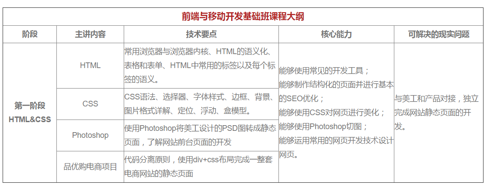
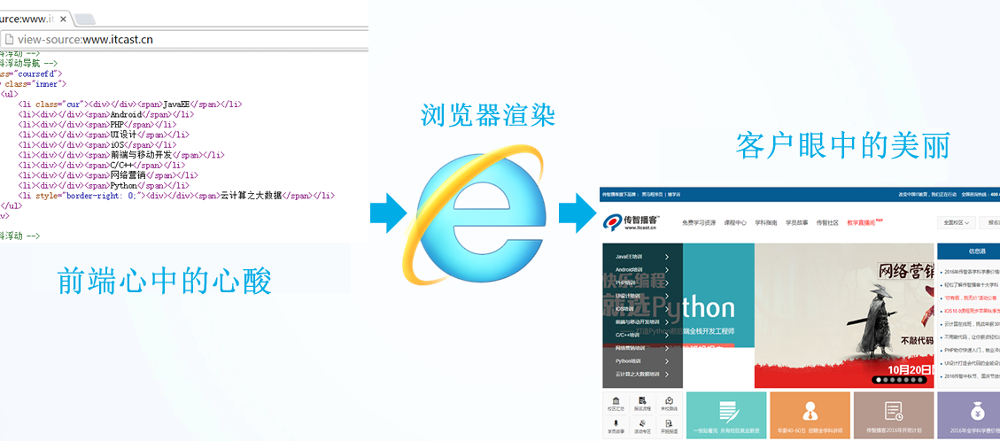

> 第01阶段.前端基础.认识WEB
# 基础班学习目标

目标：  能根据psd文件，用HTML+CSS 布局出符合W3C规范的网页。

# 课程安排



 就业班详情 参看： http://www.itcast.cn/course/web.shtml

# HTML 第一天目标

  能够写出基本的html页面（里面包含图片、链接、文字等网页元素标签）


# 认识WEB

## 1. 认识网页

```
网页主要由文字、图像和超链接等元素构成。当然，除了这些元素，网页中还可以包含音频、视频以及Flash等。
```

**思考：** 

网页是如何形成的呢?




### 总结

网页有图片、链接、文字等元素组成，我们后面的任务就是要把这部分网页元素用代码写出来。。。

## 3. Web标准（重点）

目标

* 记忆
  * 能说出网页 中 web 标准三层组成
* 理解
  * 能结合人来表述web标准三层

Web标准不是某一个标准，而是由W3C组织和其他标准化组织制定的一系列标准的集合。

W3C 万维网联盟是国际最著名的标准化组织。1994年成立后，至今已发布近百项相关万维网的标准，对万维网发展做出了杰出的贡献。

**w3c就类似于现实世界中的联合国。**

### 3.1 为什么要遵循WEB标准呢？

 通过以上浏览器的内核不同，我们知道他们渲染或者排版的模式就有些许差异，显示就会有差别。


### 3.2 Web 标准的好处

*1*、让Web的发展前景更广阔 
*2*、内容能被更广泛的设备访问
*3*、更容易被搜寻引擎搜索
*4*、降低网站流量费用
*5*、使网站更易于维护
*6*、提高页面浏览速度

###  3.3 Web 标准构成

**构成：** 主要包括结构（Structure）、表现（Presentation）和行为（Behavior）三个方面。

* 结构标准：结构用于对网页元素进行整理和分类，咱们主要学的是HTML。 对于网页来说最重要的一部分


* 表现标准：表现用于设置网页元素的版式、颜色、大小等外观样式，主要指的是CSS
* 行为标准：行为是指网页模型的定义及交互的编写，咱们主要学的是 Javascript

理想状态我们的源码： .HTML      .css      .js 

直观感受：


总结WEB标准：

**结构层：通过对语义的分析，可以对其划分结构。具有了结构的内容，将更容易阅读**

**表现层：是为了让网页就能展现出灵活多样的显示效果**

**行为层：用户对网页进行操作，网页可以做出响应性的变化。**

### 小结

* web标准有三层结构，分别是结构（html）、表现（css）和行为（javascript）  
* 结构类似人的身体， 表现类似人的着装， 行为类似人的行为动作
* 理想状态下，他们三层都是独立的， 放到不同的文件里面

## 4. 拓展@

* **介绍一下你对浏览器内核的理解？常见的浏览器内核有哪些？**

  浏览器内核包括两部分，渲染引擎和js引擎。渲染引擎负责读取网页内容，整理讯息，计算网页的显示方式并显示页面，js引擎是解析执行js获取网页的动态效果。 后来 JS 引擎越来越独立，内核就倾向于只指渲染引擎。
  IE：Trident 
  firefox：Gecko 
  chrom、safari：webkit 
  Opera：Presto 
  Microsoft Edge：EdgeHTML

  深度阅读：[五大主流浏览器内核的源起以及国内各大浏览器内核总结](http://blog.csdn.net/summer_15/article/details/71249203) 