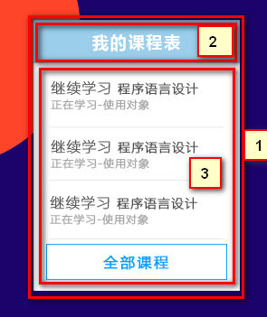
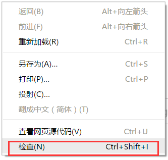
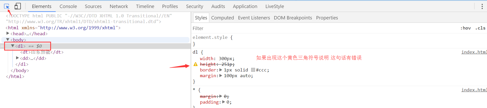
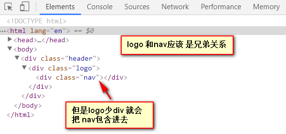
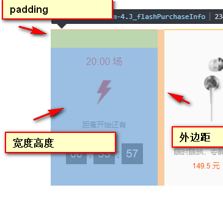

# 1. 学成在线页面制作

### 目标

- **理解**
  - 能够说写单页面我们基本的流程
  - 能说出常见的css初始化语句
  - **能说出我们CSS属性书写顺序**
- **应用**
  - 能利用ps切图
  - 能引入外部样式表
  - 能把psd文件转换为html页面

学成在线的目的就是为了串联前面的所有知识。来一个春晚大联欢。

**pink老师：**

取义**学有所成**，为师之期望，君等成才者也，故曰学成网是也~~

## 1.1 前期准备素材

* 学成在线PSD源文件
* 开发工具  =  PS（切图） +  sublime（代码） + chrome（测试）

## 1.2 前期准备工作

欲先善其事，必先利其器。 先把我们的前期准备工作做好， 我们本次采取结构与样式相分离思想。

1. 创建 study 目录文件夹 (用于存放我们这个页面的相关内容)
2. study目录内新建images 文件夹 用于保存图片。
3. 新建index.html 首页html 文件（以后我们的网站首页统一规定为index.html)
4. 新建style.css 样式文件。 我们本次采用外链样式表。
5. 将样式引入到我们HTML页面文件中。
6. 样式表写入 清除内外边距样式，来检测样式表是否引入成功。

## 1.2 CSS属性书写顺序(重点)

建议遵循以下顺序：

1. 布局定位属性：display / position / float / clear / visibility / overflow（建议 display 第一个写，毕竟关系到模式）
2. 自身属性：width / height / margin / padding / border / background
3. 文本属性：color / font / text-decoration / text-align / vertical-align / white- space / break-word
4. 其他属性（CSS3）：content / cursor / border-radius / box-shadow / text-shadow / background:linear-gradient …

```css
.jdc {
    display: block;
    position: relative;
    float: left;
    width: 100px;
    height: 100px;
    margin: 0 10px;
    padding: 20px 0;
    font-family: Arial, 'Helvetica Neue', Helvetica, sans-serif;
    color: #333;
    background: rgba(0,0,0,.5);
    -webkit-border-radius: 10px;
    -moz-border-radius: 10px;
    -o-border-radius: 10px;
    -ms-border-radius: 10px;
    border-radius: 10px;
}
```

## 1.3 布局流程

为了提高网页制作的效率，布局时通常有以下的布局流程，具体如下：

1、必须确定页面的版心（可视区）， 我们测量可得知。

2、分析页面中的行模块，以及每个行模块中的列模块。其实页面布局，就是一行行罗列而成

3、制作HTML结构。我们还是遵循，先有结构，后有样式的原则。结构永远最重要。

4、然后开始运用盒子模型的原理，通过DIV+CSS布局来控制网页的各个模块。

## 1.4 页面制作

这个页面的版心是 1200像素   每个版心都要水平居中对齐，所以，我们干脆把版心定义为：

~~~css
.w {
    width: 1200px;
    margin: auto;
}
~~~

#### 1) 头部制作

结构图如下：


* 1号是版心盒子header  1200 *  42 的盒子水平居中对齐, 上下给一个margin值就好了。
* 版心盒子 里面包含 2号盒子 logo
* 版心盒子 里面包含 3号盒子 nav导航栏
* 版心盒子 里面包含 4号盒子 search搜索框
* 版心盒子 里面包含 5号盒子 user个人信息
* 注意，要求里面的 4个盒子 必须都浮动

#### 2）banner制作

结构图如下：


* 1号盒子是通栏的大盒子banner， 不给宽度，给高度，给一个蓝色背景。
* 2号盒子是版心， 要水平居中对齐。
* 3号盒子版心内，左对齐 subnav侧导航栏。
* 4号盒子版心内，右对齐  course 课程。

#### 3）课程表模块

结构图如下：

 

* 1号盒子 是  228 * 300 的盒子 右浮动  注意 浮动的元素 不会有外边距塌陷的问题
* 1号盒子内 分为 上下 两个 子盒子
* 2号子盒子是 上部分  我们命名为 course-hd    (hd  是  head  的简写 头部的意思，我们经常用)
* 3号子盒子是 下部分  我们命名为 course-bd    (bd  是  body  的简写 主体的意思，我们经常用)

#### 4）精品推荐小模块

结构图如下：


* **复习点：**  因为里面三个盒子都要垂直居中，我们利用 继承性，给 最大的盒子 一个垂直居中的代码就好了，还记得 那些 样式可以继承吗？？？ font-  line-  text- color
* 大盒子水平居中 goods  精品 ，注意此处有个盒子阴影
* 1号盒子是标题 H3  左侧浮动
* 2号盒子 里面放链接  左侧浮动  goods-item    距离可以控制链接的 左右外边距（注意行内元素只给左右内外边距）
* 3号盒子 右浮动 mod 修改


####  5）精品推荐大模块

结构图如下：


* 1号盒子为最大的盒子 box  版心水平居中对齐
* 2号盒子为上面部分 box-hd  -- 里面   左侧标题H3 左浮动   右侧 链接 a 右浮动
* 3号盒子为底下部分 box-bd --- 里面是无序列表 有 10个 小li 组成
* 小li 外边距的问题， 这里有个小技巧。  给box-hd 宽度为 1215 就可以一行装开5个 li了
* 复习点：  我们用到清除浮动  因为 box-hd 里面的盒子个数不一定多少，我们就不给高度了，但是里面的盒子浮动了， 影响下面的布局，此时需要浮动

#### 6） 底部模块制作

结构图如下：


* 1号盒子通栏大盒子 底部 footer  给高度  底色是白色
* 2号盒子版心水平居中
* 3号盒子版权 copyright  左对齐 
* 4号盒子 链接组 links  右对齐


# 2. chrome调试工具

“工欲善其事，必先利其器”

Chrome浏览器不仅可以调试页面、JS、请求、资源、cookie，还可以模拟手机进行调试。我们现在只是使用html和css，我们先讲一下现在常用的调试。

## 2.1 怎样打开Chrome的开发者工具？

直接在页面上点击右键，然后选择  “检查”     快捷键    F12  或者   ctrl+shift+i

 

基本的结构布局是左边html 右边是 css


### chrome调试数值

可以鼠标点击后面的数值，  按下键盘  上箭头 是 调大 数值， 下箭头是 调小数值


### 快速定位css所在行数


## 2.2 Chrome提示的常见布局错误

### 1). css单词书写错误提示

用下图所示的黑色箭头，点击我们需要的 html 元素。



### 2). css无显示

声明类名和html调用名不一致   或者   css文件引入不对  或者  这个样式的前面 多余了一些符号影响的


### 3). html 结构不匹配(重要) 

左侧   展开可以看到html 标签是否匹配

 

### 4). 通过颜色判断盒子

蓝色是 盒子的 宽度高度     青色是 内边距     橙色 是外边距   通过这个很方便的看到盒子给的范围

 

### 5）看看你有如下错误吗

 

 

 

 


 


源代码：

index.html

```html
<!DOCTYPE html>
<html lang="en">
<head>
	<meta charset="UTF-8">
	<title>学成在线-不是所有的网站都叫学成在线</title>
	<link rel="stylesheet" href="style.css">
</head>
<body>
	<!-- header头部模块开始 -->
	<div class="header w">
		<!-- logo -->
		<div class="logo">
			
		</div>
		<!-- nav -->
		<div class="nav">
			<ul>
				<li><a href="#">首页</a></li>
				<li><a href="#">课程</a></li>
				<li><a href="#">职业规划</a></li>
			</ul>
		</div>
		<!-- search -->
		<div class="search">
			<input type="text" value="输入关键词">
			<button></button>
		</div>
		<!-- user -->
		<div class="user">
			
			lilei-hanmm
		</div>
	</div>
	<!-- header头部模块结束 -->
	<!-- banner 部分start -->
	<div class="banner">
		<div class="w">
			<!-- 左侧 subnav  -->
			<div class="subnav">
				<ul>
					<li><a href="#">前端开发 <span>></span></a></li>
					<li><a href="#">后端开发 <span>></span></a></li>
					<li><a href="#">移动开发 <span>></span></a></li>
					<li><a href="#">人工智能 <span>></span></a></li>
					<li><a href="#">商业预测 <span>></span></a></li>
					<li><a href="#">云计算&大数据 <span>></span></a></li>
					<li><a href="#">运维&从测试 <span>></span></a></li>
					<li><a href="#">UI设计 <span>></span></a></li>
					<li><a href="#">产品 <span>></span></a></li>
				</ul>
			</div>
			<!-- 右侧 course -->
			<div class="course">
				<div class="course-hd">我的课程表</div>
				<div class="course-bd">
					<ul>
						<li>
							<h4>继续学习 程序语言设计</h4>
							<p>正在学习-使用对象</p>
						</li>
						<li>
							<h4>继续学习 程序语言设计</h4>
							<p>正在学习-使用对象</p>
						</li>
						<li>
							<h4>继续学习 程序语言设计</h4>
							<p>正在学习-使用对象</p>
						</li>
						
					</ul>
					<a href="#" class="all">全部课程</a>
				</div>
			</div>
		</div>
	</div>
	<!-- banner 部分end -->
	<!-- goods START -->
	<div class="goods w">
		<h3> 精品推荐 </h3>
		<div class="goods-item">
			|  <a href="#">jQuery</a>
			|  <a href="#">Spark</a>
			|  <a href="#">MySQL</a>
			|  <a href="#">JavaWeb</a>
			|  <a href="#">MySQL</a>
			|  <a href="#">JavaWeb</a>
		</div>
		<div class="mod"> 修改兴趣 </div>                                                                
	</div>
	<!-- goods END -->
	<!-- box start -->
	<div class="box w">
		<div class="box-hd">
			<h3>精品推荐</h3>
			<a href="#">查看全部</a>
		</div>
		<!-- 此地方一定要清除浮动，务必务必务必 -->
		<div class="box-bd clearfix">
			<ul>
				<li>
					
					<h4>Think PHP 5.0 博客系统实战项目演练</h4>
					<p><span>高级</span>  •  1125人在学习</p>
				</li>
				<li>
					
					<h4>Think PHP 5.0 博客系统实战项目演练</h4>
					<p><span>高级</span>  •  1125人在学习</p>
				</li>
				<li>
					
					<h4>Think PHP 5.0 博客系统实战项目演练</h4>
					<p><span>高级</span>  •  1125人在学习</p>
				</li>
				<li>
					
					<h4>Think PHP 5.0 博客系统实战项目演练</h4>
					<p><span>高级</span>  •  1125人在学习</p>
				</li>
				<li>
					
					<h4>Think PHP 5.0 博客系统实战项目演练</h4>
					<p><span>高级</span>  •  1125人在学习</p>
				</li>
				<li>
					
					<h4>Think PHP 5.0 博客系统实战项目演练</h4>
					<p><span>高级</span>  •  1125人在学习</p>
				</li>
				<li>
					
					<h4>Think PHP 5.0 博客系统实战项目演练</h4>
					<p><span>高级</span>  •  1125人在学习</p>
				</li>
				<li>
					
					<h4>Think PHP 5.0 博客系统实战项目演练</h4>
					<p><span>高级</span>  •  1125人在学习</p>
				</li>
				<li>
					
					<h4>Think PHP 5.0 博客系统实战项目演练</h4>
					<p><span>高级</span>  •  1125人在学习</p>
				</li>
				<li>
					
					<h4>Think PHP 5.0 博客系统实战项目演练</h4>
					<p><span>高级</span>  •  1125人在学习</p>
				</li>
			</ul>
		</div>
	</div>
	<!-- box end -->
	<!-- box start -->
	<div class="box w">
		<div class="box-hd">
			<h3>精品推荐</h3>
			<a href="#">查看全部</a>
		</div>
		<!-- 此地方一定要清除浮动，务必务必务必 -->
		<div class="box-bd clearfix">
			<ul>
				<li>
					
					<h4>Think PHP 5.0 博客系统实战项目演练</h4>
					<p><span>高级</span>  •  1125人在学习</p>
				</li>
				<li>
					
					<h4>Think PHP 5.0 博客系统实战项目演练</h4>
					<p><span>高级</span>  •  1125人在学习</p>
				</li>
				<li>
					
					<h4>Think PHP 5.0 博客系统实战项目演练</h4>
					<p><span>高级</span>  •  1125人在学习</p>
				</li>
				<li>
					
					<h4>Think PHP 5.0 博客系统实战项目演练</h4>
					<p><span>高级</span>  •  1125人在学习</p>
				</li>
				<li>
					
					<h4>Think PHP 5.0 博客系统实战项目演练</h4>
					<p><span>高级</span>  •  1125人在学习</p>
				</li>
			
			
			</ul>
		</div>
	</div>
	<!-- box end -->

	<!-- footer start -->
	<div class="footer">
		<div class="w">
			<!-- 左侧 -->
			<div class="copyright">
				
				<p>学成在线致力于普及中国最好的教育它与中国一流大学和机构合作提供在线课程。<br>
				© 2017年XTCG Inc.保留所有权利。-沪ICP备15025210号</p>
				<a href="#" class="app"> 下载 app</a>
			</div>
			<!-- 右侧 -->
			<div class="links">
				<dl>
					<dt>关于学成网</dt>
					<dd><a href="#">关于</a></dd>
					<dd><a href="#">管理团队</a></dd>
					<dd><a href="#">工作机会</a></dd>
					<dd><a href="#">客户服务</a></dd>
					<dd><a href="#">帮助</a></dd>
				</dl>
				<dl>
					<dt>新手指南</dt>
					<dd><a href="#">如何注册</a></dd>
					<dd><a href="#">如何选课</a></dd>
					<dd><a href="#">如何拿到毕业证</a></dd>
					<dd><a href="#">学分是什么</a></dd>
					<dd><a href="#">考试未通过怎么办</a></dd>
				</dl>

				<dl>
					<dt>合作伙伴</dt>
					<dd><a href="#">合作机构</a></dd>
					<dd><a href="#">合作导师</a></dd>
				</dl>


			</div>
		</div>
	</div>
	<!-- footer end -->
	


</body>
</html>
```

style.css

```css
/*css 初始化代码 css reset*/
/*清除元素默认的内外边距*/
* {
	margin: 0;
	padding: 0;
}
/*清除列表样式*/
li {
	list-style: none;
}
/*去掉button 默认自带的边框*/
button {
	border: none;
}
body {
	background-color: #f3f5f7;
	/*方便写代码 一会别忘了删除*/
	/*height: 3000px;*/
}
a {
	text-decoration: none;
}
/*清除浮动的*/
.clearfix:before,
.clearfix:after {
	content: "";
	display: table;
}
.clearfix:after {
	clear: both;
}
.clearfix {
	*zoom: 1;
}
/*版心 1200 水平居中*/
.w {
	width: 1200px;
	margin: auto;
}
/*header start*/
.header {
	height: 42px;
	/*background-color: pink;*/
	margin: 30px auto;
}
.logo {
	float: left;
	margin-right: 60px;
}
.nav {
	float: left;
}
.nav ul li {
	float: left;
}
.nav ul li a {
	display: block;
	height: 40px;
	padding: 0 10px;
	margin-right: 20px;
	line-height: 40px;
	font-size: 18px;
	color: #050505;
	text-decoration: none;
}
/*鼠标经过链接 才有底边框*/
.nav ul li a:hover {
	border-bottom: 2px solid #00a4ff;
}
.search {
	float: left;
	margin-left: 70px;
}
.search input {
	float: left;
	width: 340px;
	height: 40px;
	border: 1px solid #00a4ff;
	border-right: 0;
	padding-left: 20px;
	color: #ccc;
}
.search button {
	float: left;
	width: 50px;
	height: 42px;
	background: url(images/btn.png);
}
.user {
	float: left;
	height: 42px;
	line-height: 42px;
	margin-left: 30px;
	font-size: 14px;
	color: #666;
}
/*banner start*/
.banner {
	height: 420px;
	background: #1c036c url(images/banner2.jpg) no-repeat top center;
}
.subnav {
	float: left;
	width: 150px;
	height: 420px;
	padding: 0 20px;
	/*背景半透明*/
	background: rgba(0, 0, 0, .3);
}
.subnav li {
	height: 45px;
	line-height: 45px;
}
.subnav li a {
	color: #fff;
	font-size: 14px;
	text-decoration: none;
}
.subnav li a:hover {
	color: #00b4ff;
}
.subnav  span {
	float: right;
}
.course {
	/*因为course 子盒子有了浮动，则就不会外边距塌陷的问题了*/
	float: right;
	width: 228px;
	height: 300px;
	background-color: #fff;
	margin-top: 50px;
}
.course-hd {
	height: 48px;
	background-color: #9bceea;
	font-size: 18px;
	text-align: center;
	line-height: 48px;
	color: #fff;
	/*文字加粗*/
	/*font-weight: bold;*/
	font-weight: 700;
}
.course-bd {
	/*没有宽度的盒子 padding 不会撑开盒子*/
	padding: 0 15px;
}
.course-bd ul {
	/*外边距塌陷的问题
	margin-top: 10px;*/
	padding-top: 10px;
}
.course-bd li {
	/*行高等与高度 只能让单行文本垂直居中*/
	height: 50px;
	border-bottom: 1px solid #ccc;
	margin-top: 10px;
}
.course-bd li h4 {
	font-size: 14px;
	color: #4e4e4e;
}
.course-bd li p {
	font-size: 12px;
	color: #a5a5a5;
}
.all {
	display: block;
	height: 38px;
	border: 1px solid #00a4ff;
	margin-top: 10px;
	font-size: 16px;
	color:  #00a4ff;
	text-align: center;
	line-height: 38px;
}
.all:hover {
	background-color: #00a4ff;
	color: #fff;
}
/*banner end*/
/*goods start*/
.goods {
	height: 60px;
	background-color: #fff;
	margin-top: 10px;
	/*利用行高可以继承的特性*/
	line-height: 60px;
	box-shadow: 2px 2px 2px rgba(0, 0, 0, .2);
}
.goods h3 {
	float: left;
	margin: 0 30px;
	font-size: 16px;
	color: #00a4ff;

}
.goods-item {
	float: left;
	color: #bfbfbf;
}
.goods-item a {
	font-size: 16px;
	color: #050505;
	margin: 0 30px;
}
.mod {
	float: right;
	margin-right: 30px;
	font-size: 14px;
	color: #00a4ff;
}
/*goods end*/
/*box start*/
.box {
	margin-top: 15px;
}
.box-hd {
	height: 60px;
	line-height: 60px;
	/*background-color: pink;*/
}
.box-hd h3 {
	float: left;
	font-size: 20px;
	color: #494949;
	/*让粗体不加粗 400 == normal*/
	font-weight: 400; 
}
.box-hd a {
	float: right;
	margin-right: 30px;
	font-size: 12px;
	color: #a5a5a5;

}
.box-bd {
	/*这个盒子一定不要给高度 因为我们可能放一行 也可能是2行 或者n行*/
	/*宽度呢？ 呵呵*/
	/*box-bd 宽度 超过了 版心 1200 是可以的，就就解决了问题*/
	width: 1215px;
}
.box-bd li {
	float: left;
	width: 228px;
	height: 270px;
	margin-right: 15px;
	margin-bottom: 15px;
	background-color: #fff;
	box-shadow: 2px 2px 2px rgba(0, 0, 0, .3);
}
.box-bd li img {
	width: 100%;
}
.box-bd li h4 {
	margin: 20px;
	font-size: 14px;
	color: #050505;
	font-weight: 400;
}
.box-bd li p {
	margin: 0 20px;
	font-size: 12px;
	color: #999;
}
.box-bd p span {
	color: orange;
}
/*box end */
/*footer*/
.footer {
	height: 385px;
	padding-top: 30px;
	background-color: #fff;
}
.copyright {
	float: left;
}
.copyright p {
	font-size: 12px;
	color: #666;
	margin: 20px 0 15px 0;
}
.app {
	display: block;
	width: 118px;
	height: 34px;
	border: 1px solid #00a4ff;
	text-align: center;
	line-height: 34px;
	font-size: 16px;
	color: #00a4ff;
}
.links {
	float: right;
}
.links  dl {
	float: left;
	margin-left: 100px;
}
.links  dt {
	height: 35px;
	font-size: 16px;
	color: #333;
}
.links  dd a {
	font-size: 12px;
	color: #333;
}
.links  dd a:hover {
	color: #004aff;
}
```

